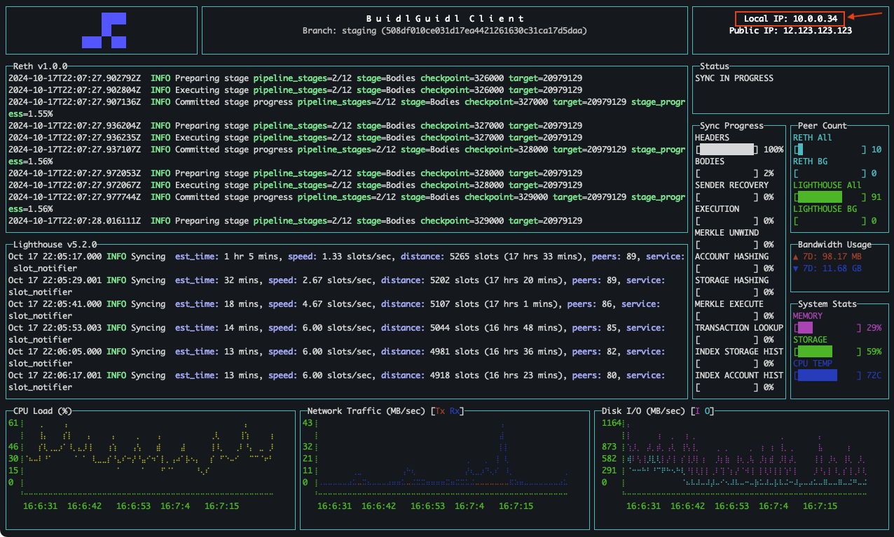

# Using viem to get the current block number from your BG Client Node

This tutorial is a quickstart guide for how to use the [viem](https://viem.sh/) library to get the current block number from your [BG Client Node](https://client.buidlguidl.com/).

&nbsp;
## Environment Setup 📚

🛠️ Before you begin, you need to make sure the following tools are installed:

- [Node](https://nodejs.org/en/download/)
- [Yarn](https://yarnpkg.com/getting-started/install)

&nbsp;
&nbsp;
## Project Setup 📚

🏃‍♂️ Run the following commands to initialize a new yarn project. 

```sh
mkdir viemScripts
cd viemScripts
yarn init -y
```

🏃‍♀️ Now run this line to add the viem package to your yarn project.

```sh
yarn add viem
```

➕ Create a new file in the root of your project called `getBlockNumber.js`. You can do that within your text editor or if you're fancy, run this:

```sh
touch getBlockNumber.js
```

🧺 Now there's just one more housekeeping task to do before we can start writing our script. We need to tell Node.js to treat our script as a module. Open up `package.json` and add `"type": "module"` to the end of the viemScripts object so that it looks like:

```json
{
  "name": "viemScripts",
  "version": "1.0.0",
  "main": "index.js",
  "license": "MIT",
  "dependencies": {
    "viem": "^2.21.28"
  },
  "type": "module"
}
```

&nbsp;
&nbsp;
## Writing the Script 📝

➕ Now we're ready to start adding code! Open `getBlockNumber.js` and add this line to the top of the file to import the viem library:

```js
import { createPublicClient, http } from "viem";
```

🕵️ OK, now we need to add a viem client to connect with your BG node. You will need to check the upper-right corner of the BG Client terminal dashboard to find the local IP address of your BG client. 


✍️ Add the following code to your script, replacing `XXX.XXX.X.XX` with your BG client's local IP address. The transport is using port 8545, which is the default port for execution layer client RPC traffic.

```js
const client = createPublicClient({
  transport: http("http://XXX.XXX.X.XX:8545"),
});
```

☝️ If your node is running on the same machine as your script, you can use the following with `localhost` acting as an alias for your local IP address:

```js
const client = createPublicClient({
  transport: http("http://localhost:8545"),
});
```

➕ Next, let's add a function to get the block number from our local node and print it to the console.

```js
async function getBlockNumber() {
  try {
    const blockNumber = await client.getBlockNumber();
    console.log("📦 blocknumber:", blockNumber);
  } catch (error) {
    console.error("Error fetching block number:", error);
  }
}
```

➕ And there's one last edit to make to our script. Let's add a line to call `getBlockNumber()` at the end of the file.

```js
getBlockNumber();
```

👌 Alright, the full script should look like this:

```js
import { createPublicClient, http } from "viem";

const client = createPublicClient({
  transport: http("http://XXX.XXX.X.XX:8545"), // Replace XXX.XXX.X.XX with your BG client's local IP address
});

async function getBlockNumber() {
  try {
    const blockNumber = await client.getBlockNumber();
    console.log("📦 blocknumber:", blockNumber);
  } catch (error) {
    console.error("Error fetching block number:", error);
  }
}

getBlockNumber();
```
> 🤨 Just make sure to replace the client transport IP address with your own BG client's local IP address (or `http://localhost:8545` if your script and node are on the same machine).

&nbsp;
&nbsp;
## Running your Get Block Number Script 📚

🏃‍♂️ Run this to execute your script:

```sh
node getBlockNumber.js
```

🔎 You should see the following output:

```sh
📦 blocknumber: 20986305n
```

😎 Not too bad for just a few lines of code!


